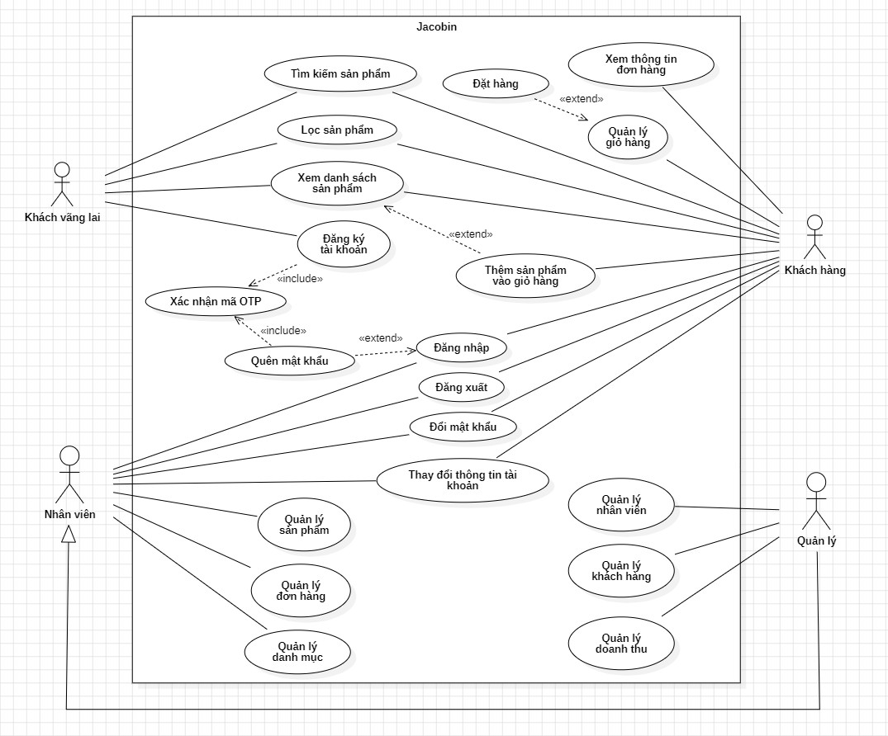
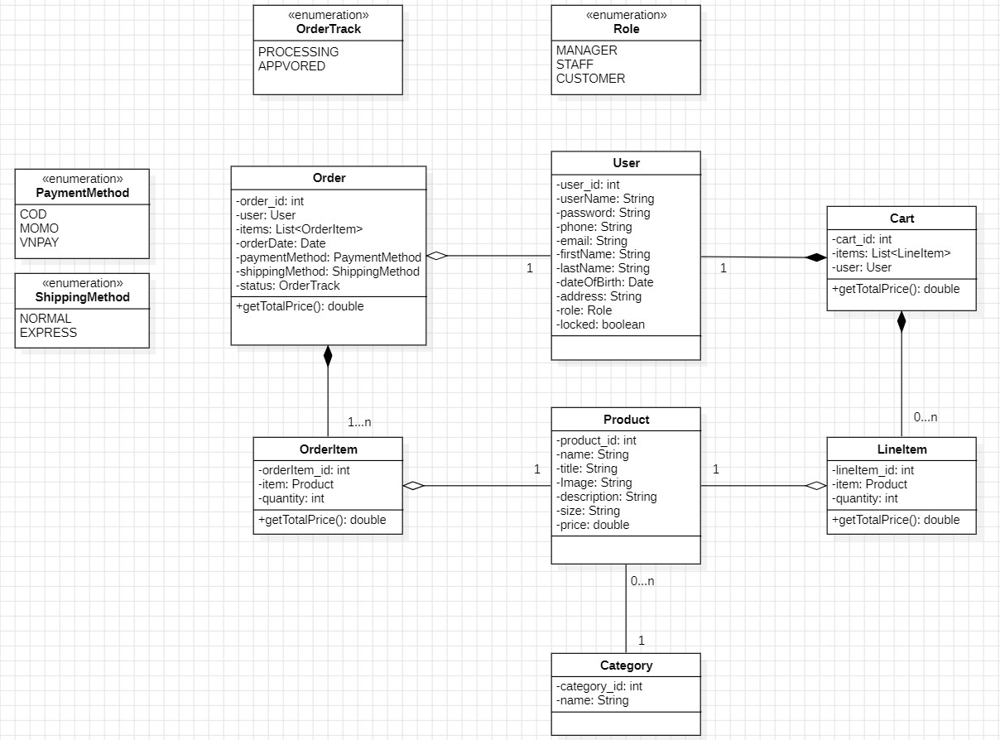

# Jacobin Store Web Application

Experience a seamless online fashion shopping journey with our modern e-commerce platform, built using Thymeleaf, Spring Boot, and MySQL as Database.

## Table of Contents

1. [Use Case Diagram](#use-case-diagram)
1. [Class Diagram](#class-diagram)
1. [Key Features](#key-features)
1. [Prerequisites](#prerequisites)
1. [Installation](#installation)
1. [Technology Stack](#technology-stack)
1. [Contributors](#contributors)
1. [Author](#author)
1. [License](#license)

## Use Case Diagram



## Class Diagram



## Key Features

- **Register:** Allows users to create new customer accounts in the system by providing necessary personal information such as username, email address, password, ....

- **Login:** Users can log in to their accounts by entering their registered username and password.

- **Logout:** Users can log out from the currently logged-in account on the system.

- **Update Account Information:** Users can update their personal information such as name, address, phone number, ...

- **Change Password:** Allows users to change their current password by providing the old password and entering a new one.

- **Forgot password:** If a user forgets their password, they can request a password reset by entering their registered email address. The system will send an OTP authentication code to the user's email. After confirming the OTP code, the user can create a new password.

- **Confirm OTP (One Time Password):** To ensure safety, users need to verify their identity through a one time password (OTP) sent to email before performing sensitive actions such as resetting the password Or register a new account.

- **Product Categories:** Users can easily browse through various product categories such as shirts, t-shirts, jeans, dresses, and more.

- **Product Search:** Supports quick search of desired products through integrated search functionality.

- **Shopping Cart:** Users can add products to their shopping cart and manage the quantity of items before proceeding to checkout.

- **Order Management:** Users can view and track the status of their orders after placing them.

- **Product Preview:** Provides images and detailed information about products to allow users to preview before making a purchase.

- **Category Management:** Staff members can manage product categories by adding, editing, or deleting them as necessary. This includes creating new categories, updating existing ones, and removing obsolete categories.

- **Product Management:** Staff members are responsible for managing products within the system. This involves tasks such as adding new products, updating product information (e.g., name, description, price), managing inventory levels, and removing discontinued products.

- **Order Management:** Staff members handle order management tasks such as viewing incoming orders, updating order status (e.g., processing, shipped, delivered).

- **Staff management:** Managers have the right to manage staffs such as adding new staffs and locking staffs accounts.

- **Customer Management:** Managers have the right to manage customer such as view customer profiles and locking customer accounts.

- **Revenue management:** Managers can track revenue by specific date, month, year.

## Prerequisites

- Java Development Kit (JDK) 21 or later
- Maven: 3.9.6
- Spring Boot: 3.2.5

## Installation

1. Clone the project from the repository:

    ```sh
    git clone https://github.com/nguyenkhanhquy/jacobin-store-spring-boot
    ```

2. Adjust configurations if necessary.

3. Run the application:

    ```sh
    mvn spring-boot:run
    ```

## Technology Stack

- Front-End: HTML, CSS, JavaScript, Thymeleaf.
- Programming Language: Java.
- Frameworks/Libraries: Spring Framework, Spring Boot, Spring Data JPA, Hibernate.
- Database: MySQL.
- IDE: IntelliJ IDEA.
- Deployment: Heroku.
- Cloud Storage: AWS S3.

## Contributors

- [@nguyenkhanhquy](https://github.com/nguyenkhanhquy)
- [@NguyenDink](https://github.com/NguyenDink)
- [@DySn0512](https://github.com/DySn0512)
- [@nghiepnt2003](https://github.com/nghiepnt2003)

## Author

- Author Name: `Nguyễn Khánh Quy`
- Email: <nguyenkhanhquy123@gmail.com>

## License

This project is licensed under the MIT License - see the [MIT License](https://github.com/nguyenkhanhquy/jacobin-store-spring-boot/blob/main/LICENSE) file for details.
